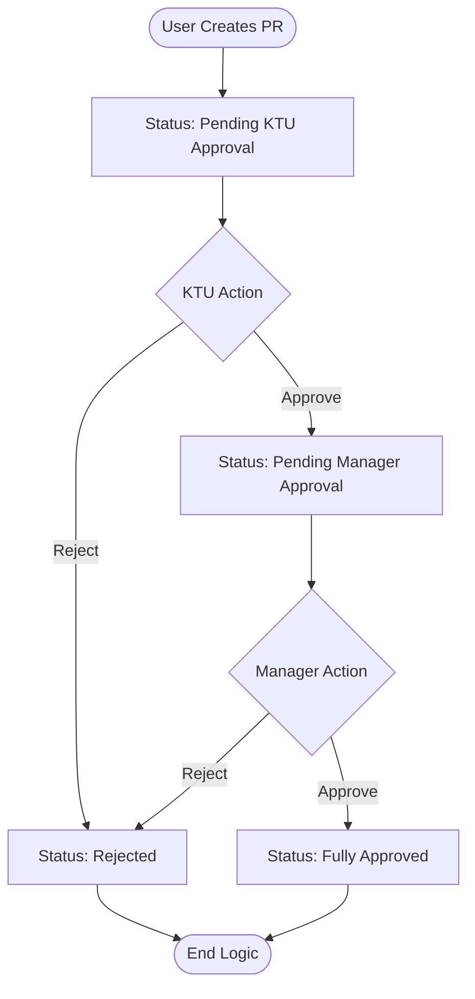
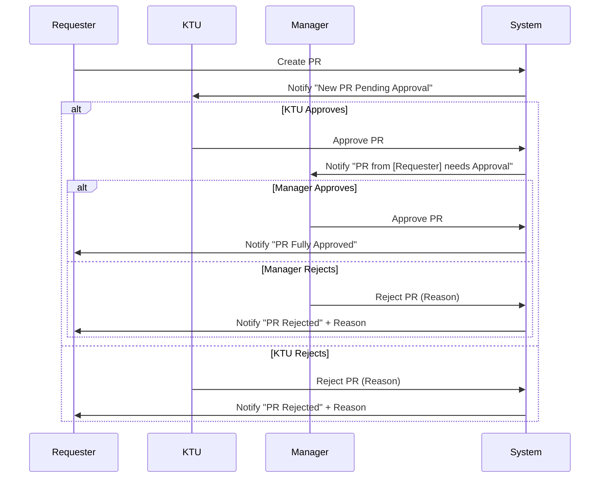
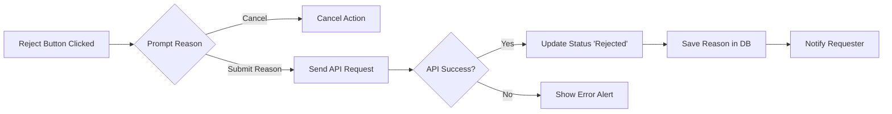

# System Flowcharts - SPA Purchasing System

This document outlines the core workflows of the Purchasing Request (PR) system using Mermaid diagrams.

## 1. Purchase Request (PR) Approval Flow

This flowchart describes the lifecycle of a Purchase Request from creation to final approval or rejection.

## 2. Notification System Flow

This flowchart describes how WhatsApp notifications are triggered based on status changes.

## 3. Rejection Logic Detail

